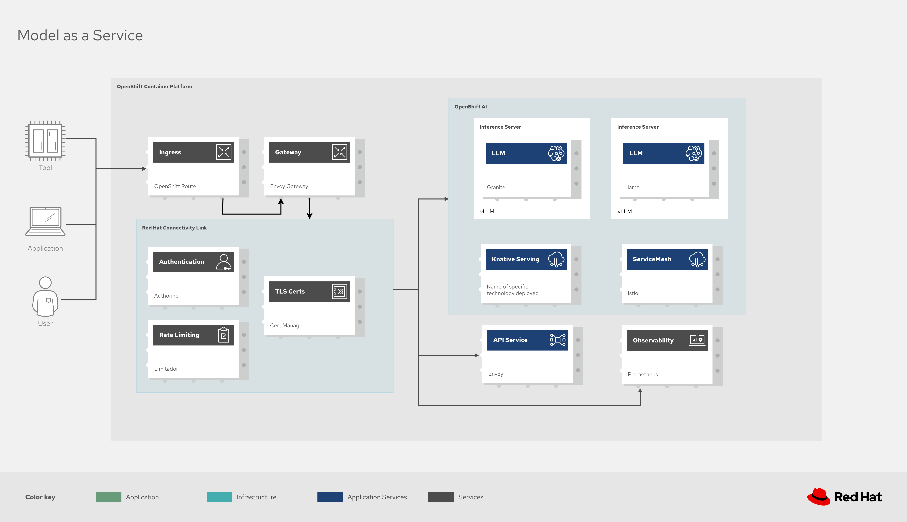
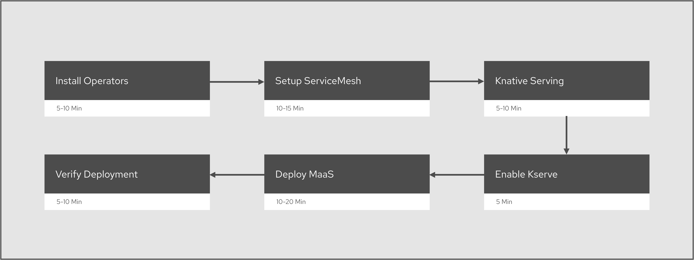

# Solution Guide for Model as a Service (MaaS)

## Table of Contents
1. [Overview](#overview)
2. [What is Model as a Service](#what-is-model-as-a-service)
3. [Architecture](#architecture)
4. [Components](#components)
5. [Prerequisites](#prerequisites)
6. [Deployment Workflow](#deployment-workflow)
7. [Step-by-Step Deployment](#step-by-step-deployment)
8. [Verify Deployment](#verification)
9. [Post-Deployment Configuration](#post-deployment-configuration)
10. [Troubleshooting](#troubleshooting)
11. [References](#references)

---

## Overview

**Models as a Service (MaaS)** enables enterprises to offer AI services that could be consumed by the entire company. This guide provides instructions for deploying MaaS on OpenShift.

## Benefits
- **Deliver AI models as shared resources** that users can access on demand
- **Provide standardized API endpoints** compatible with OpenAI API format
- **Share and access private AI models** at scale across the organization
- **Enforce governance policies** in real-time during inference requests
- **Monitor usage and costs** through comprehensive observability

<details>
<summary>Key Capabilities</summary>
<ul>
<li>Self-Service Access Control: Users can request and manage their own API tokens</li>
<li>Tier-Based Subscriptions: Different service levels (free, premium, enterprise) with distinct quotas</li>
<li>Rate Limiting: Usage limits enforced per tier to manage costs</li>
<li>Centralized Gateway: Single entry point for all model inference requests</li>
<li>Multi-Model Support: Deploy and serve multiple LLM models (Qwen, Granite, Llama, etc.)</li>
<li>Cost Management: Monitor and control inference costs through observability dashboards</li>
</ul>
</details>

### Note

MaaS is under active development and provided as a **developer preview**. It is not yet recommended for production workloads.

---

## Architecture



## Components

### 1. OpenShift AI / Open Data Hub (Core Platform)

**Purpose**: Provides the foundational platform for data science and AI workloads

**Operator**: `opendatahub-operator` or `rhods-operator`

<details>
<summary>Key Resources</summary>
 <ul>
 <li>`DataScienceCluster`: Main CR that manages all components </li>
<li>`DataScienceClusterInitialization`: Initialization configuration</li>
 </ul>
</details>

<details>
<summary>Managed Components</summary>
<ul>
<li>KServe (model serving)</li>
<li>Model Registry</li>
<li>Data Science Pipelines</li>
<li>Workbenches</li>
<li>Model Mesh (optional)</li>
</ul>
<ul>
Namespace: `opendatahub` or `redhat-ods-operator`
</ul>
</details>

### 2. KServe (Model Serving)

**Purpose**: Serverless model inference platform with auto-scaling

**Version**: Integrated with OpenShift AI 3.0+

<details>
<summary>Key Resources</summary>
<ul>
<li> `InferenceService`: Defines model deployment</li>
<li>`ServingRuntime`: Defines model server configuration</li>
<li>`ClusterServingRuntime`: Cluster-wide runtime templates</li>
  </ul>
</details>
<details>
<summary>Dependencies</summary>
   <ul> 
<li> Knative Serving (serverless runtime)</li>
<li>Istio Service Mesh (networking)</li>
</ul>
</details>

### 3. Red Hat OpenShift Serverless (Knative)

**Purpose**: Provides serverless runtime for KServe

**Operator**: `serverless-operator`

<details>
<summary>Components</summary>
<ul> 
<li>Knative Serving**: Serverless application runtime</li>
<li>Knative Eventing** (optional): Event-driven architecture</li>
</ul>
</details>

<details>
  
<summary>Key Resources</summary>
<ul>
<li>`KnativeServing`: CR to deploy Knative Serving</li>
<li>`Service`: Knative Service (auto-scaling workload)</li>
<li>`Route`: Traffic routing</li>
<li>`Revision`: Immutable snapshots of service configuration</li>
</ul>
</details>

<details>
<summary>Namespaces</summary>
<ul>
<li>`knative-serving`: Control plane</li>
<li>Model namespaces: Application workloads</li>
</ul>
</details>

### 4. Red Hat OpenShift Service Mesh (Istio)

**Purpose**: Service mesh for network management and observability

**Operator**: `servicemeshoperator`

<details>
<summary>Components</summary>
 <ul> 
<li>istiod: Control plane for configuration and policies</li>
<li>istio-ingressgateway: Ingress traffic management</li>
<li>istio-egressgateway: Egress traffic management</li>
 </ul>
</details>

<details>
<summary>Key Resources</summary>
  <ul> 
<li>`ServiceMeshControlPlane`: Main control plane CR</li>
<li>`ServiceMeshMemberRoll`: Namespaces in the mesh</li>
<li>`Gateway`: Istio gateway for ingress/egress</li>
<li>`VirtualService`: Traffic routing rules</li>
<li>`DestinationRule`: Load balancing policies</li>
  </ul>
</details>

**Namespace**: `istio-system`

### 5. Red Hat Connectivity Link (RHCL) - Policy Engine

**Purpose**: Provides policy enforcement layer for authentication, authorization, and rate limiting

**Version**: 1.2+

<details>
<summary>Components</summary>
    <ul> 
<li>Authorino: Authentication and authorization service</li>
<li>Limitador: Rate limiting service</li>
<li>Cert-manager: Certificate management</li>
    </ul>
</details>

<details>
<summary>Key Resources</summary>
  <ul>
<li>`AuthorizationPolicy`: Defines authentication rules</li>
<li>`RateLimitPolicy`: Defines rate limiting rules</li>
<li>`Certificate`: TLS certificate requests</li>
  </ul>
</details>

### 6. Envoy Gateway

**Purpose**: API gateway using Envoy proxy

**Component**: `maas-default-gateway`

<details>
<summary>Key Resources</summary>
  <ul>
<li>`Gateway`: Main gateway resource</li>
<li>`HTTPRoute`: HTTP routing rules</li>
<li>`GRPCRoute`: gRPC routing rules (optional)</li>
  </ul>
</details>

### 7. MaaS API Service

**Purpose**: Backend service for token management and user tier assignment

<details>
<summary>Key Resources</summary>
 <ul> 
<li>`Deployment`: MaaS API application</li>
<li>`Service`: Internal service endpoint</li>
<li>`ConfigMap`: `tier-to-group-mapping` for tier configuration</li>
<li>`ServiceAccount`: For API pod authentication</li>
 </ul>
</details>

<details>
<summary>Endpoints</summary>
 <ul> 
<li>`POST /maas-api/token`: Request new token</li>
<li>`GET /maas-api/tokens`: List user's tokens</li>
 </ul>
</details>

### 8. Observability Stack

**Purpose**: Monitoring and metrics collection
<details>
<summary>Components</summary>
  <ul> 
<li>Prometheus: Metrics collection and storage</li>
<li>Grafana: Dashboards and visualization</li>
<li>Limitador metrics exporter: Rate limit usage metrics</li>
  </ul>
</details>

---

## Prerequisites

### Infrastructure Requirements

<details> 
<summary>OpenShift Cluster</summary>
  <ul>
   <li>Version: 4.19.9 or higher</li>
   <li>Cluster admin access</li>
   <li>Internet connectivity for pulling images</li>
   </ul>
</details>

<details> 
<summary>Resource Requirements (Recommended)</summary>
  <ul>
   <li>vCPUs: 16+</li>
   <li>RAM: 32 GB+</li>
   <li>Storage: 100 GB+</li>
   <li>Worker nodes: 3+ (for HA)</li>
  </ul>
</details>

<details> 
<summary>Storage</summary>
  <ul>
  <li>Dynamic storage provisioner configured</li>
  <li>Default storage class set</li>
  <li>Persistent volume support</li>
</ul>
</details>

<details> 
<summary>Network Requirements</summary>
  <ul> 
   <li>External route access (for gateway)</li>
   <li>Internal service-to-service communication</li>
   <li>Container image registry access</li>
  </ul>
</details>

### Software Requirements

<details>
<summary>CLI Tools</summary>
  <ul>
   <li>`oc` (OpenShift CLI)</li>
   <li>`kubectl` (Kubernetes CLI)</li>
   <li>`kustomize` (v5.7.0+)</li>
   <li>`jq` (JSON processor)</li>
   <li>`gsed` (macOS only - GNU sed)</li>
  </ul>
</details>

<details>
<summary>Permissions</summary>
  <ul>
   <li>Cluster admin role</li>
   <li>Ability to create projects/namespaces</li>
   <li>Ability to install operators via OperatorHub</li>
  </ul>
</details>

### Pre-Installation Checks

Run these commands to verify prerequisites:

```bash
# Check cluster version
oc version

# Check node resources
oc describe nodes | grep -A 5 "Allocatable"

# Check storage classes
oc get storageclass

# Verify cluster admin access
oc auth can-i create namespaces --all-namespaces

# Check CLI tools
kustomize version
jq --version
```

---

## Deployment Workflow


---

## Step-by-Step Deployment

### Phase 1: Install Base Operators

#### Step 1.1: Install OpenShift Serverless Operator

1. **Access OperatorHub**
   ```bash
   oc get packagemanifests -n openshift-marketplace | grep serverless
   ```

2. **Install via Web Console**:
   - Navigate to: Operators → OperatorHub
   - Search: "Red Hat OpenShift Serverless"
   - Click "Install"
   - Accept defaults:
     - Installation mode: All namespaces
     - Update channel: stable
     - Approval strategy: Automatic
   - Click "Install"

3. **Verify Installation**:
   ```bash
   oc get csv -n openshift-serverless
   ```

   Expected output: `serverless-operator.vX.Y.Z` with phase `Succeeded`

#### Step 1.2: Install OpenShift Service Mesh Operator

1. **Install via Web Console**:
   - Navigate to: Operators → OperatorHub
   - Search: "Red Hat OpenShift Service Mesh"
   - Click "Install"
   - Accept defaults
   - Click "Install"

2. **Verify Installation**:
   ```bash
   oc get csv -n openshift-operators | grep servicemesh
   ```

   Expected: `servicemeshoperator.vX.Y.Z` with phase `Succeeded`

#### Step 1.3: Install OpenShift AI Operator

For **Red Hat OpenShift AI** (RHOAI):
1. **Install via Web Console**:
   - Navigate to: Operators → OperatorHub
   - Search: "Red Hat OpenShift AI"
   - Click "Install"
   - Accept defaults
   - Click "Install"

2. **Verify Installation**:
   ```bash
   oc get csv -n redhat-ods-operator
   ```

For **Open Data Hub** (ODH):
1. **Install via Web Console**:
   - Search: "Open Data Hub Operator"
   - Install similarly

2. **Verify**:
   ```bash
   oc get csv -n opendatahub
   ```

### Phase 2: Configure Service Mesh

#### Step 2.1: Create Service Mesh Control Plane

OpenShift AI automatically creates `DataScienceClusterInitialization`, which triggers Service Mesh deployment.

1. **Verify DataScienceClusterInitialization**:
   ```bash
   oc get datascienceclusterinitializations -A
   ```

2. **Check ServiceMeshControlPlane Creation**:
   ```bash
   oc get servicemeshcontrolplane -n istio-system
   ```

3. **Wait for Istio Components**:
   ```bash
   # Wait for istiod
   oc wait --for=condition=ready pod -l app=istiod -n istio-system --timeout=300s

   # Wait for ingress gateway
   oc wait --for=condition=ready pod -l app=istio-ingressgateway -n istio-system --timeout=300s

   # Wait for egress gateway
   oc wait --for=condition=ready pod -l app=istio-egressgateway -n istio-system --timeout=300s
   ```

4. **Verify All Istio Pods Running**:
   ```bash
   oc get pods -n istio-system
   ```

   Expected pods:
   - `istiod-*` (Running)
   - `istio-ingressgateway-*` (Running)
   - `istio-egressgateway-*` (Running)

### Phase 3: Configure Knative Serving

#### Step 3.1: Create DataScienceCluster

1. **Create DataScienceCluster CR**:

   Create file `dsc.yaml`:
   ```yaml
   apiVersion: datasciencecluster.opendatahub.io/v1
   kind: DataScienceCluster
   metadata:
     name: default-dsc
   spec:
     components:
       kserve:
         managementState: Managed
         serving:
           ingressGateway:
             certificate:
               type: SelfSigned
           managementState: Managed
       dashboard:
         managementState: Managed
       workbenches:
         managementState: Managed
       datasciencepipelines:
         managementState: Removed
       modelmeshserving:
         managementState: Removed
       codeflare:
         managementState: Removed
       ray:
         managementState: Removed
       kueue:
         managementState: Removed
   ```

2. **Apply the CR**:
   ```bash
   oc apply -f dsc.yaml
   ```

3. **Verify Knative Serving Deployment**:
   ```bash
   oc get pods -n knative-serving
   ```

   Expected pods:
   - `activator-*`
   - `autoscaler-*`
   - `autoscaler-hpa-*`
   - `controller-*`
   - `net-istio-controller-*`
   - `net-istio-webhook-*`
   - `webhook-*`

### Phase 4: Enable KServe

KServe is enabled in the DataScienceCluster CR above with `managementState: Managed`.

1. **Verify KServe Controller**:
   ```bash
   oc get pods -n opendatahub | grep kserve
   # OR for RHOAI
   oc get pods -n redhat-ods-operator | grep kserve
   ```

2. **Check KServe CRDs**:
   ```bash
   oc get crd | grep inferenceservice
   oc get crd | grep servingruntime
   ```

   Expected CRDs:
   - `inferenceservices.serving.kserve.io`
   - `servingruntimes.serving.kserve.io`
   - `clusterservingruntimes.serving.kserve.io`

### Phase 5: Deploy MaaS Platform

#### Step 5.1: Clone MaaS Repository

```bash
git clone https://github.com/opendatahub-io/models-as-a-service.git
cd models-as-a-service
```

#### Step 5.2: Run Deployment Script

```bash
# Set release version (use latest release tag)
export MAAS_REF="v0.0.2"

# Run deployment script
./scripts/deploy-rhoai-stable.sh
```

<details>
<summary>What the script does</summary>
  <ul>
  <li>Installs **Cert-manager operator</li>
  <li>Installs **LWS (Limitador) operator**</li>
  <li>Installs **Red Hat Connectivity Link** operator</li>
  <li>Creates `maas-default-gateway` Gateway resource</li>
  <li>Creates HTTPRoutes for `/maas-api/*` and `/v1/*`</li>
  <li>Deploys **MaaS API** service</li>
  <li>Creates authentication and rate limiting policies</li>
  <li>Configures tier-to-group mappings</li>
  </ul>
</details>

#### Step 5.3: Monitor Deployment

```bash
# Watch script output
# The script will display progress for each component

# In another terminal, monitor pods
watch oc get pods -A | grep -E "maas|limitador|authorino|cert-manager"
```

**Expected namespaces created**:
- `cert-manager`: Certificate management
- `limitador-system`: Rate limiting
- `authorino`: Authentication service
- `maas`: MaaS API and gateway

#### Step 5.4: Verify MaaS Components

```bash
# Check Gateway
oc get gateway -A

# Check HTTPRoutes
oc get httproute -A

# Check MaaS API deployment
oc get deployment -n maas

# Check all MaaS pods
oc get pods -n maas
oc get pods -n limitador-system
oc get pods -n authorino
oc get pods -n cert-manager
```

### Phase 6: Deploy Sample Models (Optional)

The deployment includes sample models for testing.

#### Option A: Deploy Simulator Model (CPU only)

```bash
cd deployment/components/models
kustomize build simulator | oc apply -f -
```

#### Option B: Deploy Facebook OPT-125M (CPU)

```bash
kustomize build facebook-opt-125m | oc apply -f -
```

#### Option C: Deploy Qwen3 (Requires GPU)

```bash
kustomize build qwen3 | oc apply -f -
```

**Verify Model Deployment**:
```bash
# Check InferenceService
oc get inferenceservice -A

# Check model pods
oc get pods -n <model-namespace>

# Wait for model to be ready
oc get inferenceservice <model-name> -n <namespace> -o jsonpath='{.status.conditions[?(@.type=="Ready")].status}'
```

---

## [Verify Deployment](https://github.com/ishuverma/PrivateMaaS-Openshift/blob/main/Verification.md)

## [Post-Deployment Configuration](https://github.com/ishuverma/PrivateMaaS-Openshift/blob/main/PostDeployment.md)


## Troubleshooting

### [Common Issues](https://github.com/ishuverma/PrivateMaaS-Openshift/blob/main/CommonIssues.md)
### [Debugging Commands](https://github.com/ishuverma/PrivateMaaS-Openshift/blob/main/Debugging.md)
### [Log Collection](https://github.com/ishuverma/PrivateMaaS-Openshift/blob/main/LogCollection.md)
---

## [References](https://github.com/ishuverma/PrivateMaaS-Openshift/blob/main/References.md)


### Next Steps
After deployment:
1. Configure tier mappings for your organization
2. Deploy production models
3. Set up monitoring dashboards
4. Distribute gateway URL to users
5. Configure custom TLS certificates
6. Set up backup and disaster recovery

For issues or questions, refer to the Troubleshooting section or consult the official documentation linked in the References section.
